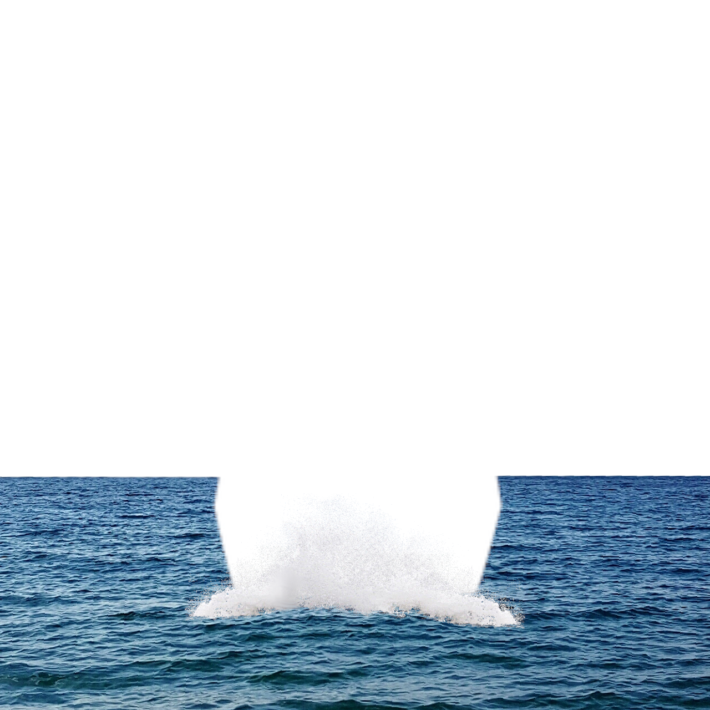

# Battleships

### [Play Singleplayer Here](https://lichenstat.github.io/battleships-royale/)

### About:
+ Playing:
	+ Playing battleships is relatively simple. Place all your ships upon the grid shown during the setup of the game (10 ships in total). After all your ships have been placed, start the game. 
	+ You and an enemy player will then take turns attacking one another's grid locations individually. A hit on a ship is marked by a  , a miss with a . 
	+ When a given player's ship locations have all been hit, that given ship will be sunk, and that players total ship count will decrease by 1.
	+ The player to have ships left afloat after all the other players ships have been sunk wins (regardless of the number of ships left).

+ Information:
	+ Battleships was made using LAMP (Linux, Apache, PHP, MySQL) stack
	+ Currently (known) compatible browsers: Chrome, Edge, Firefox 
	+ Languages used during the creation of this project:
		+ CSS 3
		+ HTML 5
		+ ES6 JavaScript
		+ PHP 8.1
		+ MySQL
	+ JavaScript has been organized in [OOP Class style](https://developer.mozilla.org/en-US/docs/Web/JavaScript/Reference/Classes) 
	+ PHP utilizes [PDO](https://www.php.net/manual/en/book.pdo.php) for MySQL queries 
	+ Http(s) requests made using [Fetch API](https://developer.mozilla.org/en-US/docs/Web/API/Fetch_API)
	+ Use of [Drag and Drop API](https://developer.mozilla.org/en-US/docs/Web/API/HTML_Drag_and_Drop_API) for ships pieces

+ Important For Deploying:
	+ Some files directories (and hrefs/srcs) might need to be changed depending on hosting options (some sites only allow index to be the main HTML file, the current main HTML file is game.html). If needed to be changed, they can be found in:
		+ Frontend:
			+ bsr-game.html (as modules, stylesheet, images)
			+ bsr-config.js (as images and sounds)
			+ bsr-playpieces.js (as #createGridPieceContents line 103)
			+ bsr-fetch.js (as this.#transmitURL for fetch connection URL)
		+ Backend:
			+ bsr-dbinfo-example.php (update necessary information for database connection and change the name of the file to bsr-dbinfo.php)
	+ When initializing and needing to create the necessary tables for the Battleships game there is a 
	method in bsr-dbmethods.php called createTables() that can be called once to automatically set up all the tables (as long as the said database user calling this methods and its queries has SQL permission to create tables as necessary)
	
+ (Side note: The code for this project is somewhat rough at the current moment and could use some nice refactoring)
	
	
